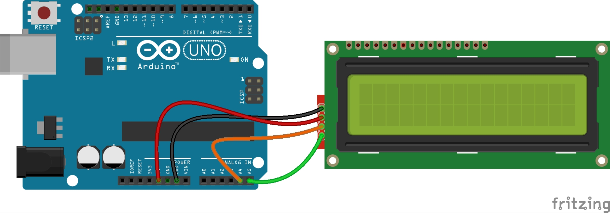
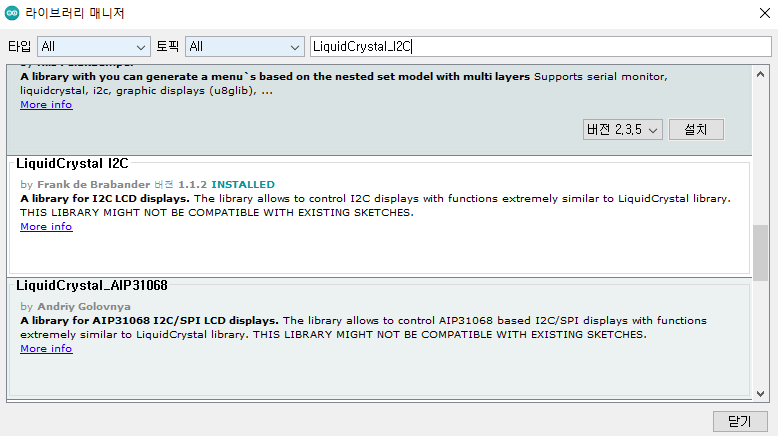

# Arduino Project
##  1. LCD
- 일반적으로 LCD는 핀이 매우 많아 활용하기가 어렵습니다. 
- 다만, 이를 간단히 설계한 모듈을 활용하면 훨씬 수월합니다. 

- 여러 모듈 중, 저는 `LiquidCrystal_I2C` 모듈을 사용해 보았습니다. 

## 2. Hardware Setting
- 언제나 그러하듯, 저는 회로부터 설계합니다. `LiquidCrystal_I2C`은 회로가 매우 간단합니다. 
<br>
<p align="center">
	
</p>


## 3. Software Coding
#### Library 다운
> 스케치 실행 - 툴 - 라이브러리 관리 - `LiquidCrystal_I2C` 검색 & 다운
> 중간에 나와요~
<br>
<p align="center">
	
</p>


### Sketch Coding
```
#include <Wire.h> 
#include <LiquidCrystal_I2C.h>

LiquidCrystal_I2C lcd(0x27,16,2);
//LiquidCrystal_I2C lcd(0x3f,16,2);     // LCD 종류에 따라 0x27, 0x3f이 있어, 
                                        // 둘 중 하나를 제품에 맞게 선택

void setup()
{
  lcd.init();                      // LCD 초기화
  lcd.backlight();                 // LCD 백라이트 On
}
  
void loop() { 
    lcd.setCursor(0,0);           // 0번째 줄 0번째 칸
    lcd.print("Hello");       
    lcd.setCursor(0,1);           // 1번째 줄 0번째 칸
    lcd.print("Arduino World!!");  
    delay(1000);                 // LCD의 모든 내용을 삭제합니다.
    lcd.clear();
}


```
### 다음에는 `IRremote`와 `LCD`를 함께 써 보겠습니다. 
<!-- [](https://youtu.be/qxe3xkCqmlQ) -->
